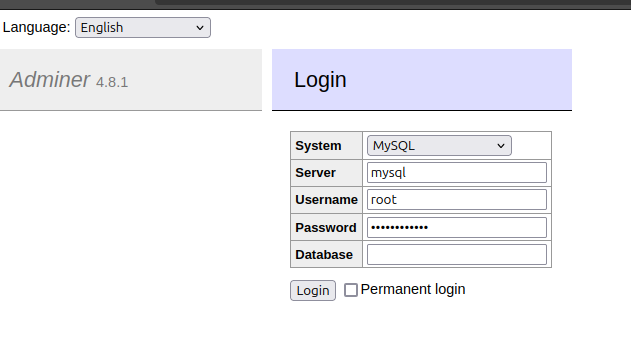

## SEVICIOS A LEVANTAR POR MEDIO DE DOCKER COMPOSE

* MYSQL -> PORT 3306
* POSTGRESQL -> PORT 5432
* MONGODB -> PORT 27017

---

Servicios adicionales: 
 - Interfaces

---

INSTANCIAR DESDE EL ROOT DEL PROYECTO PARA `MonogDB`
```bash
# Levantar el servicio
docker compose -f ./mongo/docker-compose.yml up -d

# Dar de baja el servicio
docker compose -f ./mongo/docker-compose.yml down

# acceder la interfaz grafica:
open http://localhost:8081
```

---


INSTANCIAR DESDE EL ROOT DEL PROYECTO PARA `MySQL`
```bash
# Levantar el servicio
docker compose -f ./mysql/docker-compose.yml up -d

# Dar de baja el servicio
docker compose -f ./mysql/docker-compose.yml down

# acceder la interfaz grafica:
open http://localhost:8080
```



---


INSTANCIAR DESDE EL ROOT DEL PROYECTO PARA `Postgres`
```bash
# Levantar el servicio
docker compose -f ./postgres/docker-compose.yml up -d

# Dar de baja el servicio
docker compose -f ./postgres/docker-compose.yml down

# acceder la interfaz grafica:
open http://localhost:8080
```
